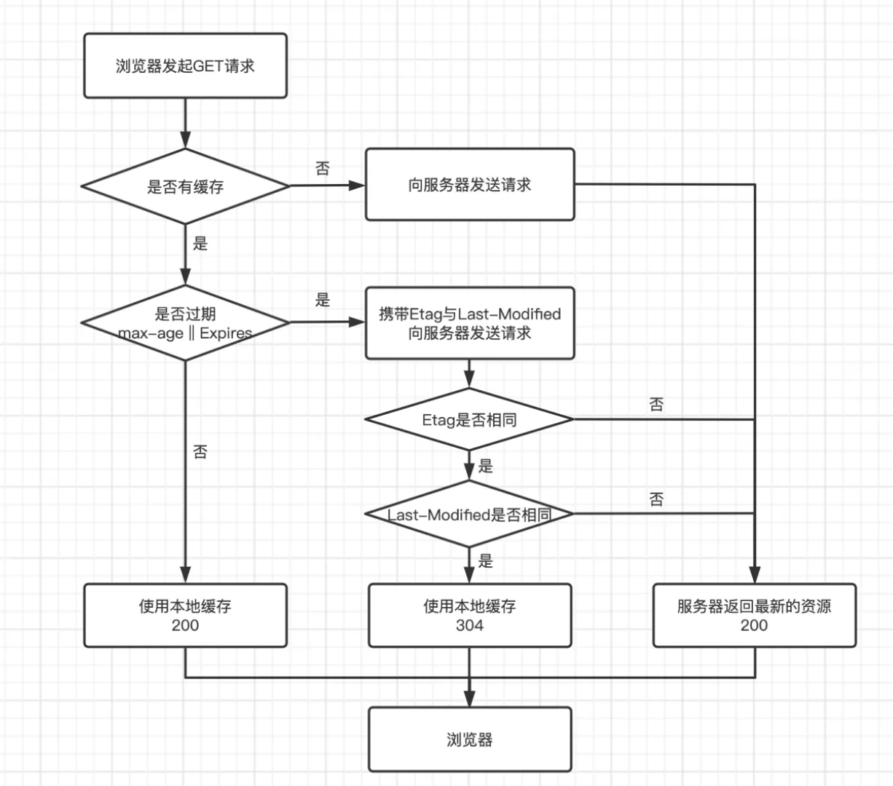

# 缓存相关

零碎的记一下。

缓存有两个类型：

- 强缓存，  
  设置之后就按照其执行，除非到期否则不再过问
  - `Expires`：HTTP 1.0，绝对时间，在这之后过期（一般不用）
  - `Cache-Control`：HTTP 1.1，比前者优先级高
    - `max-age`：这个才是强缓存，效果类似于`Expires`，相对时间，单位为秒
    - `no-cache`：不使用强缓存，必须与服务端协商（强缓存比协商缓存优先级高）
    - `no-store`：设置完全没有缓存
- 协商缓存  
  需要时刻与服务端询问是否缓存是否可用
  - `Last-Modified`
  - `ETag`

---

按照资源区分，有以下几类资源：

## 静态资源：图片、字体、CSS、JS等

利用`Cache-Control`设置强缓存。

## 动态资源：会变化的 HTML 网页

利用服务端提供的`ETag` + `Cache-Control: no-cache`，和客户端自动带上的`If-None-Match`进行协商缓存。

## 外部资源

缓存交由人家的服务器设置，“谁返回这个响应，就由谁的响应头决定是否缓存、缓存多久、是否协商缓存”。  
比如``用在线资源，那么怎么缓存由人家设置，与本服务器设置无关。
