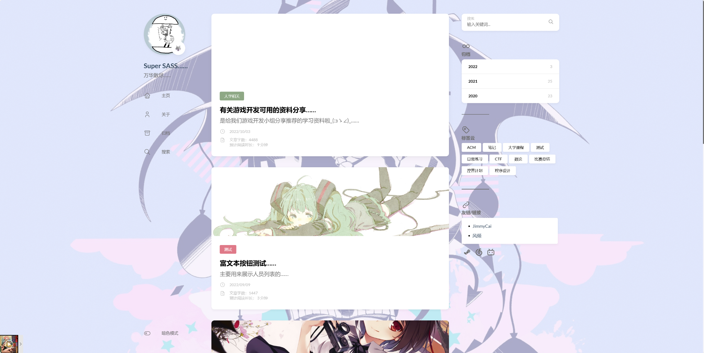
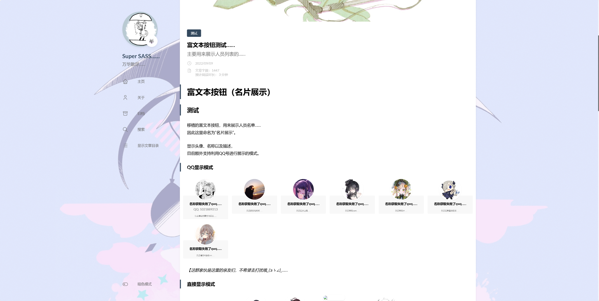
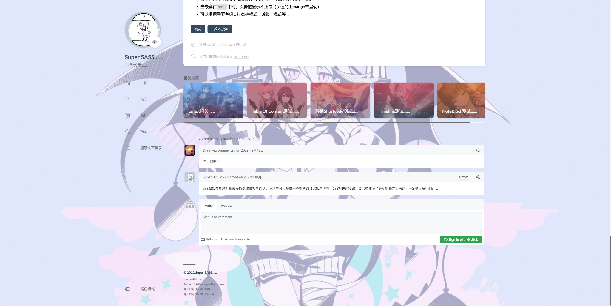
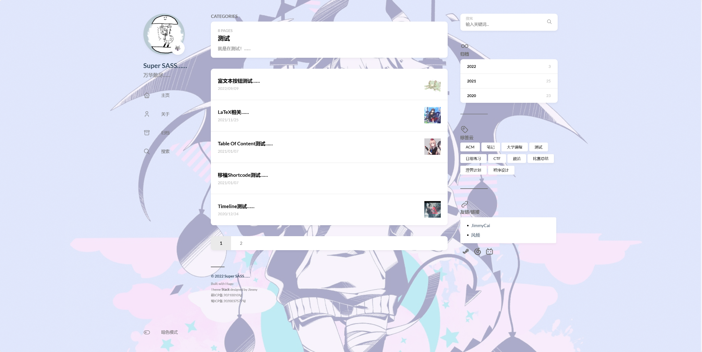

# 项目规划

## 功能需求

由于时间问题，计划实现如下功能：

* 前端：整个项目的前端应该包括前台和后台：
  * 前台展示：基本的博客那样（文章用 markdown 编写存储，只支持基本 markdown 语法即可），有：
    1. 主页：站长信息（头像名字）、导航链接（主页、类别、关于）、主页即为所有文章列表分页呈现，展示每个文章的标题摘要标签作者时间（可以以个人博客为示例，如下图）  
    
    2. 文章详细页：
       * 点进文章的页面，即文章的标题正文标签阅读时间阅读量等（可以以个人博客为示例，如下图）  
           
         
       * 评论系统：低优先级（简单可以用 utterances；复杂可采用第三方认证登录，如 Github，想的是用 Github 登陆后拿到头像名字等这些信息，然后所留言就可以展示这些信息）；
       * 导出：低优先级（预留 UI 按钮组件，可尝试用 npm 包简单实现文章导出功能（markdown, pdf，带作者/版权信息）
    3. 分类/标签页：可以以个人博客为示例，如下图。相当于用标签进行筛选  
       
    4. 其它需求：
       * 主题模式切换（可见主页图左侧的导航栏下方有个主题切换按钮）：基于 shadcn/ui 的主题切换组件
       * 图片懒加载
       * 虚拟滚动：低优先级
       * 错误边界
         
  * 后台管理
    1. 登录页（应该不包含注册页，所有用户都是后端配置好/管理员自行添加的）：基于 JWT 的认证鉴权
    2. 前台文章的管理页面：文章一览、增删改
    3. 文章编辑页：有标题、类别、标签（作者和修改时间自行确定）
       * 正文编辑：采用 markdown 编辑（先简单用 react-md-editor，后期可改用 milkdown / monaco editor）
       * AI 功能：低优先级，可以只留个口（UI按钮）并不实现，后面有时间 mock 实现（比如根据内容生成标题，根据标题生成题纲，留下这样一个功能入口，但实现只是简单的返回固定字符串，但需要日后也好修改成真正 AI 方式（比如像 py 的 OpenAI 库）
    4. 后台管理页：对后台的管理，目前可以只有一个用户管理系统，包括：
       * 用户增删改
       * 用户身份权限：管理员可以管理所有文章和用户，用户只能管理某个类别的文章（比如用户 admin 可以增删改查所有文章和用户，而普通用户 A 只能增删改查类别“生活”下的文章，普通用户 B 可以增删改查“生活”和“科技”下的文章）。
* 后端
  * 数据库：选用合适数据库（MySql/Sqlite/Mongodb/...），根据需求设计表（用户（权限怎么处理？）、文章、类别、标签、评论），尊重数据库标准规范设计模式，然后连接数据库（我不知道 node.js 有没有类似 EFCore 这种来连接管理数据库的）
  * API（Controller）：文章、用户、评论的增删改查，并对文章和用户伴随鉴权（根据db的用户表以及身份和身份下的权限）、评论伴随 OAuth（我一窍不通，只有这个构想）
  * HTTP 缓存相关
  * 接口限流（这个优先级比较低，其它全部实现了后再加这个）
  * redis 缓存（这个优先级比较低，其它全部实现了后再加这个）
  * 数据备份（这个优先级很低，其它全部实现了后再加这个，有时间再做）
  * 服务器降级（这个优先级很低，其它全部实现了后再加这个，有时间再做）
  * 前端代码分割（Code Splitting）：暂时不了解，优先级很低，有时间再做
* Share 层：DTO 数据模型定义
* monorepo 架构

## 技术栈

* **前端**
  * **框架**：React 18
  * **语言**：TypeScript
  * **UI 库**：shadcn/ui + Tailwind CSS
  * **路由**（前端 SPA 应用 + 后端 SSR App 组件）：React Router  
    > 说明：由于 SSR 会让后端根据 url 路由返回页面，可能产生混淆/疑问：为什么后端有路由（koa-router，`router.get`），前的段还要用`React-Router`？
    >
    > 因为如果只用后端路由返回页面，则做成了 MPA（多页应用），此时切换页面会导致页面刷新。  
    > 如果要**做成 SPA**，则需要搭配前端路由，此时前端里仍用`createBrowserRouter`+`RouterProvider`，后端用`createMemoryRouter`+`RouterProvider`。
  * **构建工具**：Vite
  * **功能包**
    * **Markdown 编辑器**：快速实现使用[react-md-editor](https://uiwjs.github.io/react-md-editor/)  
      后期可替换为[Milkdown](https://milkdown.dev/docs/recipes/react)
    * **文档导出**：滞后实现，待定
    * **评论**：简单可考虑 utterances，复杂可考虑 OAuth
* **后端**
  * **框架（基础框架）**：Koa 3 
    相比 Express 更轻量简洁（没有自带的中间件，需要手动组织，可加深学习）、也更先进（洋葱模型）  
    中间件：
    * **请求 body 解析**：koa-bodyparser
    * **静态资源**：koa-static
    * **路由**（SSR 总页面 + API 路由）：koa-router
    * **鉴权**：koa-jwt（如果选择 OAuth，则用 koa-passport）
    * **日志**：koa-logger
    * **跨域**：koa-cors
    * **限流**：koa-ratelimit
  * **数据库**
    * **DBMS**：Sqlite -> MySQL
      Sqlite 简单易用，无需安装服务，可以更集中于 SSR 本身的学习开发，而不浪费时间在环境配置上，  
      后期基于 ORM 也可简单迁移到更专业的数据库，如 MySQL。  
      【PostgreSQL 虽然更强大，但学习成本也更大，本项目重点并非数据库的设计和优化，且 MySQL 已足够支持博客这类项目，故选用 MySQL】
    * **ORM**（Data Access Layer）：Prisma  
      比较成熟、全面的 ORM，在定义 schema 后，自动生成 Migrations + 构建数据库 + 生成 Client，后续使用 Client 来 CRUD 数据库（避免写 SQL）。  
      【现代趋势有 Drizzle，但其更底层复杂，不生成 Client 需要自己连接 db 写 SQL，数据库在本项目非重点，故本项目采用更简单成熟的 Prisma】
  * **功能插件**
    * **Markdown 解析**：markdown-it + sanitize-html（防止 XSS）
* **整体**
  * **仓库组织**：monorepo
    ```
    /apps
      /web
      /server
    /packages
      /shared
    ```
  * **环境配置**
    * dotenv：环境变量配置
    * cross-env：跨平台兼容

### 拓展认识

* 后端基础框架区别 - Express / Koa / Fastify
  * Express：比较早和经典的一个框架，功能全面丰富（集成路由、静态资源、body解析等）、**中间件模型是流线性的**（`next()`相当于`return`会结束该中间件处理），架构偏老（不是天生为`async/await`设计的）。
  * Koa：是 Express 原创团队开发的新框架，功能极简（路由等需要导入额外包）、**中间件模型是洋葱模型**（`next()`是 Promise 的，故内层中间件结束后会回来继续，类比于事件捕获和冒泡），带来许多好处（错误全局捕获、鉴权、日志等）。基本可以看作 Express 的升级版
  * Fastify：追求高性能 + 企业级工程化，速度比 Koa 高，功能比 Express 还全面丰富（支持 Schema 数据检验），以插件（生命周期钩子）为核心而非中间件（如`fastify.setErrorHandler()`）  
    这个项目基于学习目的，故采用最简的 Koa 以理解各种底层细节（自己处理错误、日志、鉴权等），后期可以转到 Fastify。
* 全栈框架 - Next.js / Nuxt.js(Vue 版本)  
  这个可以理解为前后端合并在一起的开发框架（全栈 Web 框架），其基于 React 同时完成页面搭建和 API 开发。  
  但本项目需要从底层彻底吃透 SSR 原理，故先用 React + Koa 这种架构来实现，后续可以转到 Next.js。
* 后端应用级/企业级框架 - Nest.js  
  可以理解为对基础框架(Express/Koa/Fastify)的进一步封装，类似于 ASP.NET Core MVC，其也是基于 MVC 架构，有控制器、依赖注入等企业级规范。  
  对小应用过于笨重，故不采用。  
  类似框架还有：阿里的 Egg.js
* 后端开发/部署模式 - Serverless  
  传统开发：需要一台自己管理的服务器（nginx + node.js + mysql），部署服务，24h运行  
  而 Serverless：交给云平台管理，按 FaaS / BaaS 模式，按需使用和付费，无需管理服务器  
  一些框架，如 Next.js / Hono 等，更适配 Serverless。

## Ex. 相关知识学习

* 要写两个原本 CSR 的`main.tsx`
  * `entry-client.tsx`：客户端（浏览器）入口，用`hydrateRoot`，构建时通过`target: web`生成 client bundle，在 dist 的 index.html 中通过`<script src="assest/entry-client.[hash].js"></script>`引入。
  * `entry-server.tsx`：服务端（后端 Koa）入口，用`renderToString`/`renderToPipeableStream`，构建时通过`target: node`生成 server bundle，不会出现在 dist 的 index.html 中。Koa 通过`import { render } from "../../web/dist/server/entry-server.js"`引入。
* 有关路由：对于 SSR SPA，前后端都要用 React Router，后端额外用 koa-router 写一个通用页面请求
  * 首先定义一个通用的`router.tsx`，包含`{path, element}`
  * 服务器实现一个`fetchDataForUrl`方法，根据 url 路径获取数据
  * 服务器的`ssr.ts`中，写通用的页面路由
    ```ts
    // server/ssr.ts
    import { render } from '../../web/dist/server/entry-server';
    import { fetchDataForUrl } from './fetchDataForUrl';

    router.get('(.*)', async (ctx) => {
    const url = ctx.path;
    const { data } = await fetchDataForUrl(url);

    const appHtml = render(url, data);

    ctx.type = 'text/html';
    ctx.body = htmlTemplate(appHtml, data);
    });
    ```
  * 前端在`entry-client.tsx`中，用`createBrowserRouter`+`RouterProvider`
    ```tsx

    ```
  * 前端在`entry-server.tsx`中，用
    ```tsx
    // entry-server.tsx（server bundle）
    import React from 'react';
    import ReactDOMServer from 'react-dom/server';
    import { App } from './App';

    export function render(url: string, initialData: any) {
    return ReactDOMServer.renderToString(
        <App url={url} initialData={initialData} />
    );
    }
    ```